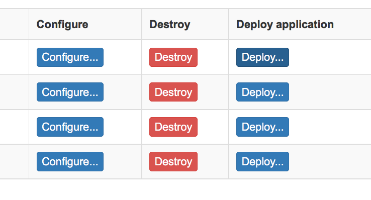
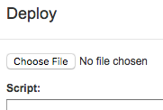
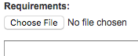
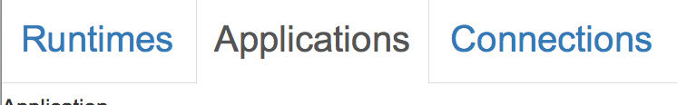
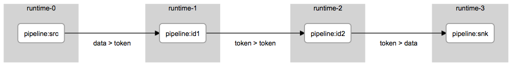
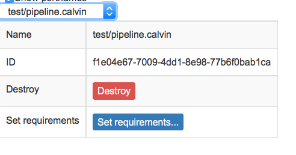

# Calvin and docker #

Assuming you have a working installation of docker, either build an image using the
supplied docker files, or fetch them from dockerhub. 

## Building a docker image ##

Building an image is straightforward. Here is how we built the images available on
dockerhub:

    $ make master

for the image of the GitHub master branch, and 

    $ make develop

for the develop branch. There are also raspberry pi images available, which can be built with

    $ make PLATFORM=rpi master

and similarly for develop, of course. There is also an image which includes dependencies necessary to run the examples:

    $ make DEPS=y master

and, for raspberry pi,

    $ make DEPS=y PLATFORM=rpi master

It is of course also possible to build them manually, e.g.

    $ docker build -t erctcalvin/calvin -f Dockerfile .

They can be pulled from dockerhub using

    $ docker pull erctcalvin/calvin:master

and

    $ docker pull erctcalvin/calvin:develop

for the master and develop images, respectively. For the raspberry pi images, the prefix is `rpi-`, and for the images including dependencies, the suffix is `-deps`. So to fetch the raspberry pi image based on the master branch with all dependencies, use

    $ docker pull erctcalvin/rpi-calvin-deps:master

There is also a make target for when you have made changes (on the develop branch) and just want to
include them:

    $ make local

will build an image based on the develop image with the changes in the current repository. See the Makefile for details; among other things, it assumes the calvin-base repo is located in `../../`. If you want to use another namespace than the official erctcalvin, pass your preference to the Makefile, e.g.

    $ make NAMESPACE=mycalvin develop

will build the develop branch image, and name it `mycalvin/calvin:develop`.

Once an image is available, the following should list the available actor namespaces:

    $ ./dcsdocs.sh
    Calvin: Merging cloud and IoT
    Modules: exception, io, json, media, misc, net, std, text, web

## Interactive use ##

In order to use calvin interactively in the image, start it as

    $ docker run -ti erctcalvin/calvin:master
	
and you will get a prompt, with the current path being the root of the Calvin installation. To run an example, try

    $ cd calvin/examples/sample-scripts
	$ csruntime --host localhost test1.calvin

Note that in a distributed Calvin-system, the runtimes need to know their externally visible IP. 

## Starting Calvin ##

When running Calvin distributed, there are two options for the registry, which is how Calvin handles discovery and information sharing between runtimes. Either have a designated Calvin runtime handling the registry for the system, or have it distributed in a DHT (distributed hash table). It is also possible to have a mixture of these in the same system, but for simplicity we only cover the clean cut cases.

### Designated registry

The registry runtime needs to be started first, before any of the others. The following command starts a runtime, names it "registry" and sets it to not use an external registry - i.e. it handles its own registry. Of course, it also needs an externally visible ip address for the other runtimes to use when communicating with it, and a port to use for the runtime to runtime communication. It is also prudent to expose a port for the control API using the `-c` option. More on that later.

    ./dcsruntime.sh -e <ip> -l -n registry -p <port> -c <another port>

We recommend `5000` and `5001`, respectively. There is an optional argument `-i` which sets which image to use. The default is `erctcalvin/calvin:master`

To start more runtimes, use the following:

    $ ./dcsruntime.sh -e <ip> -r <previous pi>:<previous port> -n <name>

The naming is optional, and can be omitted (in which case the runtime will get the name of the docker container it is running in.) The `-r` option tells the runtime that the registry is handled by the runtime located at `<ip>:<port>`. For example, the following will start 4 runtimes in separate containers, using the address `192.168.0.100`, with the first one as registry:

    $ ./dcsruntime.sh -e 192.168.0.100 -l -n runtime-0 -p 5000 -c 5001
	$ ./dcsruntime.sh -e 192.168.0.100 -r 192.168.0.100:5000 -n runtime-1
	$ ./dcsruntime.sh -e 192.168.0.100 -r 192.168.0.100:5000 -n runtime-2
	$ ./dcsruntime.sh -e 192.168.0.100 -r 192.168.0.100:5000 -n runtime-3

There is a shortcut for this in the `setup_system.sh` script:

    $ ./setup_system.sh -e 192.168.0.100 proxy

This script has a few additional parameters. See later sections for details.

Start the web interface:

    $ ./dcsweb.sh 8000

and point your browser at `http://localhost:8000` (if you are using e.g. dockermachine, then `localhost` will not work - in that case it should be the ip of the VM hosting the containers). Enter the control uri of the registry runtime when asked - `http://192.168.0.100:5001` in this example.

The list should include all 4 runtimes with the specified names. Go to the section on deployment to continue, or start over and setup a system with distributed registry, described in the next section.

### Distributed registry

The distributed registry is implemented using a dynamic hash table (DHT) - specifically the [Kademlia DHT](http://pdos.csail.mit.edu/~petar/papers/maymounkov-kademlia-lncs.pdf). For the proxy solution, each runtime uses the designated registry runtime for discovery, whereas for the DHT implementation, a simple UPnP discovery is used. While it is convenient when it works, there are numerous network issues and details that may prevent it from working, and we have yet to identify and fix all the possible problems. Consequently, it is less straightforward than the proxy case, and due to the nature of a distributede hashtable, it is somewhat ill-suited for small systems where runtimes come and go frequently.

To start calvin in a docker container using the distributed registry, use

    $ ./dcsruntime.sh -e <ip> -n name

Again, the naming is optional. To set up a system of 4 runtimes in separate container, named `runtime-0` to `runtime-3` using address `192.168.0.100`, the following should work:

    $ ./dcsruntime -e 192.168.0.110 -c 5001 -n runtime-0
    $ ./dcsruntime -e 192.168.0.110 -n runtime-1
    $ ./dcsruntime -e 192.168.0.110 -n runtime-2
    $ ./dcsruntime -e 192.168.0.110 -n runtime-3

The first runtime gets a fixed control port, 5001, in order to be able to find it easily in `csweb`. There is nothing inherently important with 5001, any port will work (if it is available.)

Again, there is a shortcut for this scenario:

    $ ./setup_system.sh -e 192.168.0.100 dht

Starting the web interface with

    $ ./dcsweb.sh 8000

and pointing your browser at `http://localhost:8000` (with exceptions as in the previous section) should give a view of the runtimes known to the system, after entering the control uri of one of the runtimes - `http://192.168.0.100:5001` is the obvious choice, since it is known, but any of them should work.

## Deploying an application

Once a system is up an running, it is not doing anything much until there is an application executing in it. There are a few different ways of deploying an application in a Calvin system. It can be done using the control gui (CSWeb), using the command line tool `cscontrol` or using the REST-based control API each node presents. Both the control gui and the control command uses the control API. If you are interested in writing a gui or a command line tool, then the control API is where to start, it is described in some detail on the [github wiki](https://github.com/EricssonResearch/calvin-base/wiki/Calvin-Control-API).

There is a small application in `extras/docker/test` which can be distributed over the four runtimes started earlier. 

### Deploying from the command line

Using the previously setup system, with a known control uri at `http://192.168.0.100:5001`, the following deploys the application to a single runtime:

    $ cscontrol http://192.168.0.100:5001 deploy test/pipeline.calvin

The result of the command shows some information about the deployed application, e.g. the id of the application, the ids of all actors in the application, and whether the requirements could be satisfied. Since there were no requirements supplied, they are trivially satisfied. Make a note of the application id.

Look at the log of runtime-0 with

    $ ./dcslog.sh runtime-0

and it should contain a number of lines similar to this:

    2016-07-06 17:25:40,260 INFO     11-calvin.Log: fire

The important part is the `fire` at the end, since that is what the application enters into the log.

There is an accompanying file with deployment requirements in `test/pipeline.deployjson`. Use the following command to have Calvin apply the requirements (of course, with the ip number changed to whatever you have been using so far.) 

    $ cscontrol http://192.168.0.100:5001 applications <application id> --reqs test/pipeline.deployjson

Replace `<application id>` with the id of the application you deployed earlier. If you forgot to make a note of it, find out with

    $ cscontrol http://192.168.0.100:5001 applications list

If you have followed the instructions, there should only be one application listed. 

The deployment requirements should now have move the logging actor from runtime-0 to runtime-3. Looking in the log of runtime-0, it should now end with

    016-07-06 17:45:00,083 INFO     11-calvin.Log: fire
    016-07-06 17:45:00,281 INFO     11-calvin.Log:  -- migrating

and then nothing further, while in runtime-3, we find

    2016-07-06 17:45:00,328 INFO     12-calvin.Log:  -- finished migrating
    2016-07-06 17:45:00,400 INFO     12-calvin.Log: fire                  

and then a number of repeats of the last entry.

It is also possible to deploy an application together with the deployment requirements:

    $ cscontrol http://192.168.0.100:5001 deploy --reqs test/pipeline.deployjson test/pipeline.calvin

### Deploying from GUI.

In the gui, on the first page, click the `deploy..` button on runtime-0.

In the deployment dialog that opens, click `choose file` at the top, select the file `extras/docker/test/pipeline.calvin` (the precise location depends on your OS, installation, etc.)

and then, in the same dialog, click `choose file` under requirements a bit lower down,

select the file `extras/docker/test/pipeline.deployjson`, and then click  `Deploy` at the bottom of the dialog.

This will send the script together with the requirements to Calvin, and, if everything works out, it should be possible to visually inspect the application by clicking `Applications`:

Select the application `test/pipeline.calvin` from the drop down menu

and a visual representation of the application should appear in your browser.

It is also possible to set the requirements after deployment, using the `Set requirements...` button here:

## Helper scripts

In the `extras/docker` directory is a collection of helper scripts for managing a system of calvin runtimes. Some of them you have already encountered.

### `dcsweb.sh`

Start csweb in a docker container.

    Usage: dcsweb.sh 
       -i <image>[:<tag>]   : Docker image (and tag) to use [erctcalvin/calvin:master]
       -p <port>            : Port to use [8000]

Example usage:

    $ ./dcsweb.sh 8000    

will start a container presenting the CSWeb gui on port 8000 (see earlier example on deployment.)

##`setup_system.sh`

Set up a number of calvin runtimes. 

    Usage: setup_system.sh -ctn -r <number>-i <image> -e <ip> [proxy/dht/cleanup]
       -i <image>[:<tag>]   : Calvin image (and tag) to use [erctcalvin/calvin:develop]
       -e <external-ip>     : External IP to use
       -n                   : Native, not dockers
       -r <number>          : Number of extra runtimes beyond the first one
       -t                   : Run tests (requires 3+1 runtimes)
       -c                   : Cleanup after tests

This script has a `native` mode (`-n`) which starts up runtimes without using dockers. This requires a working calvin installation. Can also execute some basic deployment tests on a collection of runtimes (four). The tests can be executed as follows (exchange the given ip with yours.)

Execute a test with distributed registry
  
    $ ./setup_system.sh -c -t -e 192.168.0.100 dht

Execute test with designated registry
 
     $ ./setup_system.sh -c -t -e 192.168.0.110 proxy
 
To close all running calvin runtimes - in dockers and otherwise
 
    $ ./setup_system.sh cleanup

## __`dcsdocs.sh`__ 

Run `csdocs` in a docker container. 

    Usage: dcsdocs.sh <actor or namespace>
         -i <image>[:<tag>]   : Calvin image (and tag) to use [erctcalvin/calvin:master]
         <args sent to csdocs>
         (use --help to get help on csdocs usage)

Straightforward. Make sure you use the long option `--help` for help on csdocs.

## `dcsruntime.sh`

Start calvin in a docker container.

    Usage: dcsruntime.sh 
            -i <image>[:<tag>]   : Calvin image (and tag) to use [erctcalvin/calvin:master]
            -e <external-ip>     : External IP to use
            -n <name>            : Name of container & runtime
            -c <port>            : Port to use for control uri
            -p <port>            : Port to use for runtime to runtime communication
            -l                   : Use local registry (non-distributed)
            -r <ip>:<port>       : Use runtime calvinip://<ip>:<port> as registry
            -v                   : Verbose output
            -d                   : dry run, do not start Calvin
             <args to csruntime>

Note that this script has changed since the last release, so have a look at the arguments before using it if you think you are familiar with its usage.
